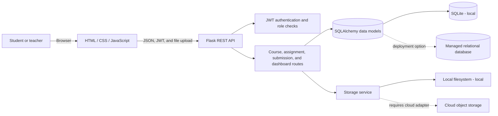

# Cloud-Based Student Assignment Submission & Feedback Portal

A role-based academic portal for course work, assignment submissions, grading, and feedback. It combines a Flask REST API with a responsive HTML, CSS, and JavaScript frontend.

> **Project status:** This is a locally runnable academic prototype, not a live cloud deployment. Its current defaults are SQLite, local filesystem uploads, and application-managed JWT authentication. The cloud architectures below are deployment plans; a managed cloud database, object-storage adapter, production identity configuration, and hosting have not been provisioned by this repository.

## Author

**Adarsh Srivastav**

Cloud Computing coursework project

## Table of Contents

- [Project Overview](#project-overview)
- [Problem Statement](#problem-statement)
- [Objectives](#objectives)
- [Key Features](#key-features)
- [User Roles](#user-roles)
- [Working Principle](#working-principle)
- [Cloud Computing Concepts](#cloud-computing-concepts)
- [System Architecture](#system-architecture)
- [Software and Tools](#software-and-tools)
- [Database Design](#database-design)
- [File Storage](#file-storage)
- [Authentication and Authorization](#authentication-and-authorization)
- [Assignment Workflow](#assignment-workflow)
- [Submission Workflow](#submission-workflow)
- [Feedback and Grading](#feedback--grading)
- [API Reference](#api-reference)
- [Project Structure](#project-structure)
- [Installation](#installation)
- [Environment Variables](#environment-variables)
- [Local Setup](#local-setup)
- [Running the Application](#running-the-application)
- [Testing](#testing)
- [Cloud Deployment Plan](#cloud-deployment-plan)
- [Security](#security)
- [Scalability](#scalability)
- [Failure Handling](#failure-handling)
- [Project Screenshots](#project-screenshots)
- [Results and Validation](#results-and-validation)
- [Limitations](#limitations)
- [Future Scope](#future-scope)
- [Skills and Learning Outcomes](#skills-and-learning-outcomes)
- [Conclusion](#conclusion)

## Project Overview

The portal supports an end-to-end coursework workflow. Teachers organize work into courses, publish assignments, and review submissions. Students enroll in courses, submit permitted files before deadlines, and receive grades and feedback.

The application can be run locally without paid cloud services. Local operation is useful for coursework, testing, and demonstrations; it should not be confused with a production cloud installation.

## Problem Statement

Email, paper, and disconnected file-sharing workflows make assignment tracking, deadline visibility, submission access, grading, and feedback difficult to manage consistently. A single role-aware portal can bring these activities together and demonstrate how an application can be structured for a future cloud deployment.

## Objectives

- Provide separate student and teacher workflows.
- Manage courses, assignments, submissions, deadlines, and feedback through a web interface.
- Protect API operations with authentication and role checks.
- Validate uploads and provide controlled submission downloads.
- Demonstrate an application architecture that can be adapted to managed cloud services.
- Make the project reproducible and testable on a local machine.

## Key Features

- Student and teacher registration and login.
- JWT-protected REST endpoints and role-based access controls.
- Course creation, browsing, and student enrollment.
- Assignment creation and management with deadlines, maximum marks, file-size rules, and allowed extensions.
- Submission upload and resubmission, subject to assignment rules.
- Server-side late-submission checks.
- Teacher submission review, downloads, grading, and written feedback.
- Student and teacher dashboards with assignment, course, submission, and review summaries.
- Local SQLite persistence and filesystem file storage.
- API and workflow tests using Pytest.

## User Roles

| Role | Capabilities |
| --- | --- |
| Student | Browse and enroll in courses, view assignments and deadlines, upload submissions, download personal submissions, and view grades and feedback. |
| Teacher | Create courses and assignments, view course submissions, download submitted files, and grade work with feedback. |
| Admin | The API includes selected admin-aware authorization paths; a complete admin dashboard is not implemented. |

New accounts can select a student or teacher role. This is convenient for a local academic demonstration, but public role selection is not an appropriate production authorization policy.

## Working Principle

The portal connects the teacher and student activities in one coursework flow:

```text
Teacher creates a course
    -> Student enrolls
    -> Teacher publishes an assignment
    -> Student uploads a file
    -> Teacher reviews and grades the work
    -> Student views the grade and feedback
```

## Cloud Computing Concepts

- **Client-server architecture:** Browser interface calls a Flask REST API.
- **Elasticity and managed services (deployment goal):** A hosted application and managed database can scale independently of a developer's machine.
- **Cloud database (deployment goal):** SQLAlchemy models separate relational records from their local SQLite development database.
- **Object storage (deployment goal):** A storage service boundary isolates file operations from submission metadata. The current configured implementation stores files on the local filesystem.
- **Identity and access management:** JWT authentication and role checks demonstrate application-level access control. A production deployment may integrate a managed identity provider.
- **Configuration and secrets:** Runtime settings are read from environment variables; deployment secrets should be stored in a provider's secret manager.
- **Observability:** The Flask application logs startup and server errors and exposes a health endpoint. Managed log aggregation is not configured here.

## System Architecture



The solid paths show what the local application uses. The dotted paths are possible deployment integrations, not services currently connected by this project.

## Software and Tools

| Area | Technology |
| --- | --- |
| Backend | Python, Flask, Flask-CORS |
| Data access | Flask-SQLAlchemy / SQLAlchemy |
| Local database | SQLite |
| Authentication | PyJWT and Werkzeug password hashing |
| Frontend | HTML, CSS, vanilla JavaScript |
| Local file storage | Python filesystem storage service |
| Tests | Pytest |

## Database Design

The SQLAlchemy models in `backend/models/database.py` define:

| Entity | Purpose | Relationships |
| --- | --- | --- |
| `User` | Stores name, email, password hash, role, and creation time. Password hashes are not included in its public dictionary representation. | A teacher can own courses; students have enrollments and submissions. |
| `Course` | Stores course name, unique course code, description, and teacher. | Has assignments and student enrollments. |
| `Enrollment` | Links a student to a course and prevents duplicate enrollment in the same course. | References one student and one course. |
| `Assignment` | Stores course, title, description, deadline, marks, upload rules, and creator. | Belongs to a course and can have student submissions. |
| `Submission` | Stores assignment/student IDs, original filename, storage path, submission state, marks, and feedback. | References one assignment, one student, and optionally a grader. |

SQLite is used for local development and automated tests. Production use requires a managed database, a migration strategy, backups, and suitable access policies.

## File Storage

The active storage service saves submitted files on the local filesystem. The database stores submission metadata and a storage path; it does not store the uploaded file contents.

For a cloud deployment, implement and configure a provider-backed storage adapter, then use private buckets/containers and short-lived authorized download URLs. Suitable service families include Amazon S3, Azure Blob Storage, or Google Cloud Storage. Environment variables such as `STORAGE_BACKEND`, `CLOUD_STORAGE_BUCKET`, and `CLOUD_STORAGE_KEY` exist as configuration points, but a cloud adapter and production cloud credentials are **not** supplied or enabled by this repository.

## Authentication and Authorization

- Registration and login return a signed JWT and user profile.
- The frontend stores the token in browser `localStorage` and sends it as a Bearer token on API calls.
- Backend middleware verifies the token and role before protected actions.
- Students and teachers use separate dashboard routes; sensitive operations are enforced on the server, not only hidden in the interface.
- Passwords are hashed using Werkzeug before they are stored.

For a public production system, review token storage and expiry, enforce a controlled role-assignment policy, use managed secrets and HTTPS, and consider an established identity service. Never reuse the seeded demo credentials in production.

## Assignment Workflow

1. A teacher creates a course.
2. A student browses the course catalog and enrolls.
3. The teacher creates an assignment for a course and sets its deadline, maximum marks, and file rules.
4. Enrolled students view the assignment and its submission status.
5. The teacher reviews submissions and can return marks and feedback.

## Submission Workflow

1. The student selects a file for an assignment.
2. The API checks authorization, file presence, permitted extension, size, deadline, and resubmission rules.
3. The storage service saves the file; the database records its metadata and storage path.
4. The student can view their submission and download it through an authorized API route.
5. The teacher can review and download submissions for assignments they are allowed to manage.

Late-submission behavior and resubmission availability are controlled by assignment settings and validated by the backend.

## Feedback & Grading

Teachers grade a submission by providing marks and written feedback. The API validates the marks against the assignment maximum and records the grader and grading time. Students retrieve feedback only for submissions they are authorized to access.

## API Reference

All API routes are served by the Flask application. Protected routes require `Authorization: Bearer <token>`. File submission uses `multipart/form-data`.

| Method | Endpoint | Purpose / access |
| --- | --- | --- |
| `GET` | `/api/health` | Health check. |
| `POST` | `/api/register`, `/api/auth/register` | Register a student or teacher. |
| `POST` | `/api/login`, `/api/auth/login` | Authenticate and receive a JWT. |
| `GET` | `/api/profile`, `/api/auth/profile` | Read the current user's profile. |
| `POST` | `/api/logout`, `/api/auth/logout` | Logout route. |
| `GET` | `/api/users` | List users; restricted by backend authorization. |
| `GET`, `POST` | `/api/courses` | List courses or create a course (teacher). |
| `POST` | `/api/courses/<course_id>/enroll` | Enroll a student in a course. |
| `GET`, `POST` | `/api/assignments` | List assignments or create an assignment (teacher). |
| `GET`, `PUT`, `DELETE` | `/api/assignments/<assignment_id>` | Read or manage one assignment, subject to role/ownership rules. |
| `POST` | `/api/assignments/<assignment_id>/submit` | Upload or resubmit assignment work (student). |
| `GET` | `/api/submissions/me` | List the current student's submissions. |
| `GET` | `/api/assignments/<assignment_id>/submissions` | List submissions for teacher review. |
| `GET` | `/api/submissions/<submission_id>` | Read an authorized submission. |
| `GET` | `/api/submissions/<submission_id>/download` | Download an authorized submission file. |
| `POST` | `/api/submissions/<submission_id>/grade` | Grade a submission (teacher). |
| `GET` | `/api/submissions/<submission_id>/feedback` | Retrieve authorized feedback. |
| `GET` | `/api/dashboard/student` | Student dashboard summary. |
| `GET` | `/api/dashboard/teacher` | Teacher dashboard summary. |

The API is implemented in `backend/routes/`. Request and response payload details can be inspected in the route handlers and exercised with the test suite.

## Project Structure

```text
.
├── backend/
│   ├── app.py
│   ├── config.py
│   ├── middleware/
│   ├── models/
│   ├── routes/
│   ├── services/
│   └── utils/
├── frontend/
│   ├── css/
│   ├── js/
│   └── index.html
├── screenshots/
├── tests/
├── .env.example
├── .gitignore
├── README.md
└── requirements.txt
```

| Path | Purpose |
| --- | --- |
| `backend/app.py` | Flask application factory, blueprint registration, health endpoint, and frontend serving. |
| `backend/config.py` | Development, production, and testing settings loaded from environment variables. |
| `backend/middleware/` | JWT authentication and role-authorization decorators. |
| `backend/models/` | SQLAlchemy entities, database setup, and local demonstration data. |
| `backend/routes/` | Authentication, course/assignment, submission, and dashboard endpoints. |
| `backend/services/` | Authentication and local filesystem storage logic. |
| `backend/utils/` | Shared request and upload validators. |
| `frontend/index.html` | Browser application shell. |
| `frontend/css/` | Responsive styles and visual design system. |
| `frontend/js/` | API client, auth/session helpers, UI rendering, and workflows. |
| `tests/` | Pytest API and workflow tests. |
| `screenshots/` | Project workflow evidence and screenshot notes. |
| `instance/` | Runtime SQLite data; generated locally and ignored by Git. |
| `uploads/` | Runtime uploaded files; generated locally and ignored by Git. |

`instance/` and `uploads/` are runtime-created, git-ignored directories. A separate `cloud/`, `docs/`, `reports/`, or `sample_files/` folder is not present in this implementation.

## Installation

### Prerequisites

- Python 3.11 or newer.
- Git, if cloning the project.
- Windows PowerShell instructions are shown below; Python and pip are also available on macOS/Linux.

## Environment Variables

Start with `.env.example`. Values below describe the configuration currently read by `backend/config.py`.

| Variable | Purpose | Local default |
| --- | --- | --- |
| `FLASK_ENV` | Selects development, production, or testing configuration. | `development` |
| `FLASK_DEBUG` | Enables Flask debug mode; keep disabled in production. | `True` in base config |
| `SECRET_KEY` | Flask application secret. | Development placeholder in code; replace it. |
| `JWT_SECRET_KEY` | Signs JWT access tokens. | Development placeholder in code; replace it. |
| `JWT_EXPIRY_HOURS` | JWT lifetime in hours. | `24` |
| `HOST`, `PORT` | Local server bind address and port. | `0.0.0.0`, `5000` |
| `LOG_LEVEL` | Application logging verbosity. | `INFO` |
| `DATABASE_URL` | SQLAlchemy connection URL. | `sqlite:///assignment_portal.db` |
| `STORAGE_BACKEND` | Storage provider selection. Local filesystem is implemented. | `local` |
| `LOCAL_UPLOAD_DIR` | Local upload directory. | `uploads` |
| `MAX_FILE_SIZE_MB` | Maximum accepted upload size. | `10` |
| `ALLOWED_EXTENSIONS` | Comma-separated permitted extensions. | `pdf,docx,doc,txt,zip,png,jpg,jpeg` |
| `CORS_ORIGINS` | Comma-separated permitted browser origins for API CORS. | Local development origins |
| `CLOUD_STORAGE_BUCKET`, `CLOUD_STORAGE_KEY` | Cloud-storage configuration placeholders. | Empty; cloud adapter is not implemented. |
| `RATE_LIMIT` | Reserved rate-limit setting. | `100/hour`; no rate-limiter integration is configured. |

The Flask app currently serves the frontend and API from one origin, so CORS is usually unnecessary for local use. Do not put real credentials into source control or the public `.env.example`.

## Local Setup

From the project root in Windows PowerShell:

```powershell
python -m venv .venv
.\.venv\Scripts\Activate.ps1
python -m pip install -r requirements.txt
Copy-Item .env.example .env
```

If PowerShell prevents virtual-environment activation, use the environment's Python executable directly:

```powershell
.\.venv\Scripts\python.exe -m pip install -r requirements.txt
```

No separate frontend package manager or build step is required; the frontend uses browser-native HTML, CSS, and JavaScript.

## Running the Application

With the virtual environment activated:

```powershell
python -m flask --app backend.app run
```

Or start the configured host and port using Python:

```powershell
python -c "from backend.app import create_app; from backend.config import get_config; c=get_config(); create_app().run(host=c.HOST, port=c.PORT, debug=c.DEBUG)"
```

Open [http://127.0.0.1:5000](http://127.0.0.1:5000). On first startup, the app creates database tables and seeds demo accounts, courses, and assignments if the database is empty.

### Demo accounts

| Role | Email | Password |
| --- | --- | --- |
| Teacher | `teacher@example.com` | `teacher123` |
| Student | `student@example.com` | `student123` |

These fixed credentials and seeded records are for local demonstration only. Do not deploy the demo accounts or use real student information in the showcase database.

### End-to-end demonstration

1. Sign in with the teacher account and create a course or assignment.
2. Sign in with the student account and enroll in an available course if needed.
3. Open an assignment and upload a permitted sample file.
4. Return to the teacher dashboard, open the assignment, and review its submission.
5. Grade the work and add written feedback.
6. Sign in as the student again to view the grade and feedback.

The application serves the browser interface and API on the same port. Uploaded files are written under the configured local upload directory; submission metadata is stored in the configured database.

## Testing

Run the suite from the project root:

```powershell
python -m pytest -q
```

The current suite covers health checks, registration/login, role authorization, assignment creation, student submission uploads, authorized downloads, grading, and authentication route aliases. A successful run currently reports **8 passed**.

## Cloud Deployment Plan

The repository does not include deployment manifests or a cloud storage adapter. The following are implementation approaches for taking the prototype online; each requires provider setup and testing before it can be called deployed.

### Approach A: Student-friendly managed hosting

One possible low-cost design is:

1. **Frontend and backend:** Deploy the Flask app to a Python-capable web host such as Render. The app currently serves the frontend and API together; keeping them on one origin avoids extra CORS setup.
2. **Database:** Replace the local SQLite database with a managed PostgreSQL instance and configure `DATABASE_URL`. Confirm the selected host's persistence, sleep, backup, and pricing terms; “free tier” availability changes over time.
3. **Files:** Implement a cloud-storage adapter and connect a private bucket such as Supabase Storage or an S3-compatible service. Do not rely on an ephemeral application filesystem for durable student submissions.
4. **Authentication:** The current Flask JWT authentication can be retained only after production hardening (strong secret, HTTPS, role-assignment controls, expiry/revocation policy). Alternatively, integrate Supabase Auth or another hosted identity provider.
5. **Configuration:** Set secrets as host-managed environment variables, restrict allowed origins, turn off debug mode, and verify file permissions and access control.

This approach is a deployment plan, not a preconfigured one-click deployment for this repository.

### Approach B: AWS reference architecture

| Capability | Possible AWS service |
| --- | --- |
| Static frontend | Amazon S3 + CloudFront; configure API routing separately. Alternatively, run the existing Flask-served frontend with the backend. |
| Flask backend | AWS App Runner, Elastic Beanstalk, ECS/Fargate, or EC2. |
| API gateway | API Gateway when using API Gateway-integrated services such as Lambda; it is optional when exposing an App Runner service directly. |
| Relational data | Amazon RDS for PostgreSQL. DynamoDB would require a data-access redesign rather than a drop-in SQLAlchemy URL change. |
| Submission files | Private Amazon S3 bucket, with scoped access or presigned downloads after authorization. |
| Managed identity (optional) | Amazon Cognito, with application/API integration replacing or federating the current JWT login flow. |
| Secrets and logs | AWS Secrets Manager or Systems Manager Parameter Store; CloudWatch Logs and metrics. |

**Equivalent service families:** Azure Static Web Apps or Blob Storage/CDN for frontend assets, App Service or Container Apps for Flask, Azure Database for PostgreSQL, Blob Storage, Microsoft Entra External ID, and Azure Monitor. On Google Cloud, options include Cloud Storage with Cloud CDN, Cloud Run, Cloud SQL for PostgreSQL, Cloud Storage, Identity Platform, and Cloud Logging/Monitoring.

### Local development vs cloud deployment

| Local development | Cloud deployment |
| --- | --- |
| SQLite file in the local `instance/` directory. | Managed database with backups, migrations, and access controls. |
| Files on local disk under `uploads/`. | Private durable object storage and authorized download links. |
| Demo JWT secrets and seeded accounts. | Strong managed secrets, production identity controls, and no demo accounts. |
| Flask development server and local logs. | Production WSGI/container hosting, HTTPS, health monitoring, and centralized logs. |
| Local browser at `127.0.0.1`. | Public URL, restricted CORS, DNS/TLS, and provider-specific deployment configuration. |

## Security

Implemented security controls include password hashing, JWT-protected API routes, role checks, upload validation, server-side deadline checks, and authorized submission file routes.

Before production use:

- Replace the development secret defaults in `backend/config.py` with strong, unique secrets stored outside the repository.
- Disable debug mode and remove/disable seeded demo accounts and demo-data initialization.
- Prevent untrusted users from self-assigning privileged roles.
- Require HTTPS and review token storage, expiry, refresh, logout, and revocation behavior.
- Configure private object storage, least-privilege permissions, upload scanning, and retention/deletion policies.
- Use a managed database with backups and TLS; review CORS, logging, monitoring, and rate limiting.
- Avoid public student records in screenshots, logs, test fixtures, and repository history.

These notes are not a claim of a security audit or production readiness.

## Scalability

The application separates API routes, models, and services, which gives a starting point for scaling the API independently and replacing local infrastructure. SQLite and local disk are single-machine development choices; horizontal scaling requires a shared managed database, durable object storage, production server processes, and tested concurrency behavior. Database indexing, pagination, background processing, caching, and load testing are future work.

## Failure Handling

The Flask app returns JSON error responses for common HTTP errors, including missing routes, oversized uploads, and internal errors. API requests in the frontend surface network and server errors through notifications. A production system should additionally provide structured request IDs, safe retries for idempotent operations, monitoring/alerts, backup and restore procedures, and explicit handling for partial failures between file storage and database writes.

## Project Screenshots

Project evidence screenshots document the local setup, application workflows, test results, mobile layout, and GitHub repository. The files are listed in the [screenshots guide](screenshots/README.md):

| Screenshot | Demonstrates |
| --- | --- |
| [Project structure](screenshots/01_project_structure.png) | Workspace folders and project organization. |
| [App running](screenshots/02_app_running.png) | The portal served locally in a browser. |
| [API health](screenshots/03_api_health.png) | A successful backend health check. |
| [Course creation](screenshots/04_teacher_course_created.png) | Teacher course management. |
| [Assignment creation](screenshots/05_assignment_created.png) | Assignment setup and upload rules. |
| [Student enrollment](screenshots/06_student_enrolled.png) | Student course enrollment. |
| [Student submission](screenshots/07_student_submission.png) | Assignment file upload. |
| [Teacher review](screenshots/08_teacher_reviewed.png) | Teacher submission review. |
| [Grading and feedback](screenshots/09_grade_and_feedback.png) | Teacher grading and written feedback. |
| [Student feedback](screenshots/10_student_feedback.png) | Student view of the returned grade and feedback. |
| [Passing tests](screenshots/11_tests_passed.png) | Test run reporting 8 passed. |
| [Mobile layout](screenshots/12_mobile_layout.png) | Responsive app view at a mobile viewport. |
| [GitHub repository](screenshots/13_github_repository.png) | Project repository hosted on GitHub. |

Application screenshots show the local prototype, not a live cloud deployment. The current implementation uses SQLite and local filesystem storage; no cloud dashboard or hosted application is represented.

## Results and Validation

- The Flask application serves both the REST API and browser frontend locally.
- Student and teacher flows for courses, assignments, submissions, grading, and feedback are represented.
- The project test suite currently passes **8 tests**.
- Thirteen project evidence screenshots are available in `screenshots/`.

## Limitations

- No hosted cloud database, cloud object-storage adapter, cloud identity provider, CI/CD workflow, or cloud deployment is configured.
- The app seeds public demo credentials and data into an empty database; this must be disabled for production.
- SQLite and local uploads do not provide durable multi-instance cloud storage.
- There is no implemented admin user interface.
- Rate-limit configuration exists, but no rate-limiting extension is integrated.
- Automated tests cover selected workflows, not full browser, load, accessibility, or security validation.

## Future Scope

- Add PostgreSQL migrations and a production database configuration.
- Implement provider-backed object storage with private access and signed downloads.
- Add production role provisioning and optional managed identity integration.
- Remove demo seeding from production startup and add secure account administration.
- Add API schema documentation, pagination, rate limiting, and structured observability.
- Add browser-based end-to-end tests, accessibility checks, and responsive visual regression tests.
- Add a verified CI pipeline and deployment instructions for a selected cloud provider.

## Skills and Learning Outcomes

- Building a Flask application factory and REST API.
- Modeling relational data and relationships with SQLAlchemy.
- Implementing JWT authentication and role-based authorization.
- Validating file uploads and separating file metadata from stored file content.
- Implementing deadline-aware submissions, grading, and feedback workflows.
- Testing API behavior and documenting the difference between a local prototype and a cloud deployment.

## Conclusion

The portal demonstrates a complete local coursework workflow, from course and assignment setup through submission, grading, and feedback. It also provides a foundation for studying how application services, relational data, identity controls, and file storage could be adapted for a cloud deployment. Cloud hosting and managed storage are not implemented in this repository.
