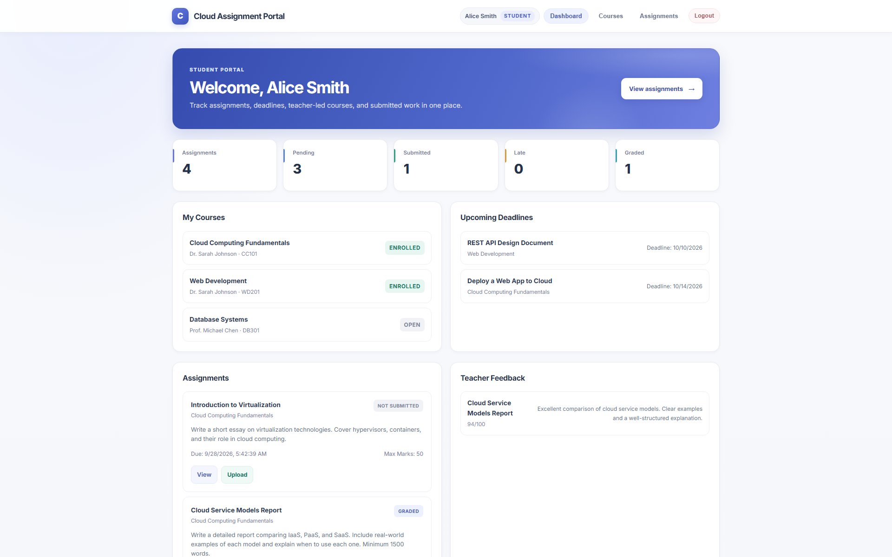
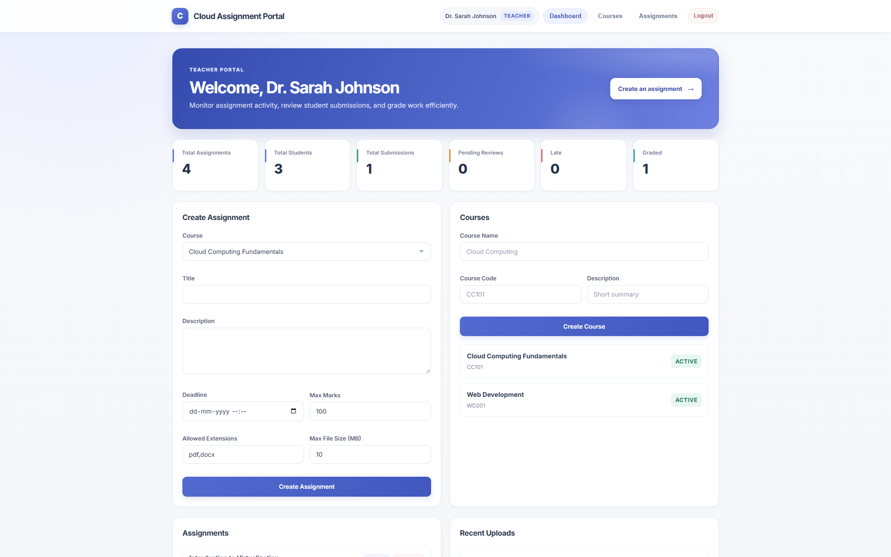
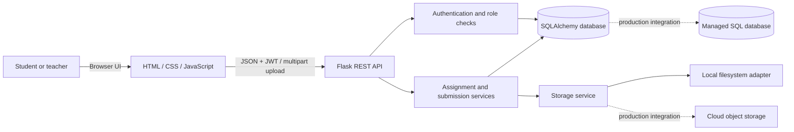

# Cloud-Based Student Assignment Submission & Feedback Portal

A role-based academic portal for course work, file submissions, grading, and feedback. The application uses a Flask REST API and a browser-based HTML/CSS/JavaScript client.

> **Deployment status:** This repository is a local academic prototype. It currently uses SQLite and local disk storage by default; it is not connected to a hosted cloud database or object-storage provider. The storage and configuration boundaries make those deployment integrations possible, but a real provider, production secrets, and hosting setup must be configured before describing it as a live cloud deployment.

## Product overview

### Student experience

- Register, sign in, browse courses, and enroll.
- Review assignment details, deadlines, submission status, and file requirements.
- Upload or resubmit assignment files.
- Download personal submissions and review marks and instructor feedback.
- Track pending work, submissions, upcoming deadlines, and course progress.

### Teacher experience

- Create courses and assignments with deadlines, file rules, and marks.
- Review assignment submissions and download student files.
- Grade work and return feedback.
- See class activity, submission counts, and work awaiting review.

### Application capabilities

- JWT-based authentication and role-protected API routes.
- Flask application factory and REST endpoints.
- SQLAlchemy data models for users, courses, enrollments, assignments, and submissions.
- Validated file upload/download through a storage service.
- Responsive student and teacher dashboards.
- Pytest coverage for core authentication, authorization, submission, and grading workflows.

## Screenshots

The reviewed, fictional-data showcase captures are in `screenshots/`:

| Suggested file | Screen | Best use |
| --- | --- | --- |
| `student-dashboard.png` (1920 × 1200) | Student dashboard with assignments, deadlines, and progress | LinkedIn carousel / Instagram slide |
| `teacher-dashboard.png` (1920 × 1200) | Teacher overview with class activity and management tools | LinkedIn carousel / Instagram slide |
| `assignment-review.png` (1920 × 540) | Assignment details and submission review | LinkedIn carousel |
| `feedback-view.png` (1920 × 329) | Student marks and instructor feedback | Instagram carousel |
| `mobile-dashboard.png` (1080 × 1920) | Narrow-screen student dashboard | Instagram Story / Reel cover |





For additional captures, run the app locally, sign in with the seeded **demo-only** accounts below, use a browser viewport around **1440 × 1000** (or **1920 × 1080**), hide browser extensions and unrelated tabs, and scroll to the top of each screen before capturing. Use fictional demo data only; crop out the address bar if sharing a public URL, and never expose real student records, email addresses, tokens, or uploaded files.

### Social post dimensions

- **LinkedIn:** Capture the app at 16:9 for a single landscape image (for example 1920 × 1080). For a carousel, export a consistent set of 4:5 slides (1080 × 1350) with one feature per slide and readable type.
- **Instagram feed:** Use 4:5 portrait (1080 × 1350) for the dashboard and workflow carousel; keep important content away from the outer edges.
- **Instagram Story/Reel cover:** Use 9:16 portrait (1080 × 1920). Show a single focused screen or place the landscape screenshot inside a designed frame with generous margins. Do not stretch the interface.

Add a concise caption, meaningful alt text, and a small project title/technology label if needed. Avoid adding fake cloud-provider logos or implying a production deployment that has not happened.

## Architecture



Locally, the seeded demonstration environment uses SQLite and local uploads. For a cloud deployment, select and configure a managed database and object-storage adapter, add production-grade identity/secrets handling, and deploy the API and frontend to hosting infrastructure. The dotted diagram paths represent future integration points, not currently provisioned services.

## Technology

- **Backend:** Python, Flask, Flask-CORS, Flask-SQLAlchemy, PyJWT, Werkzeug
- **Frontend:** HTML, CSS, vanilla JavaScript
- **Local database:** SQLite
- **Local file storage:** Filesystem storage service
- **Tests:** Pytest

## Project structure

```text
backend/
  app.py                    Flask app factory, API registration, and static frontend
  config.py                 Environment-based settings
  middleware/               Authentication and role authorization
  models/                   SQLAlchemy entities and local demo-data initialization
  routes/                   Authentication, assignment, submission, and dashboard APIs
  services/                 Authentication and file-storage services
  utils/                    Shared request and upload validators
frontend/
  index.html                Application shell
  css/style.css             Responsive visual system and components
  js/api.js                 REST API client
  js/auth.js                Browser authentication/session handling
  js/app.js                 Routing, events, and page workflows
  js/components.js          Navigation and page rendering
tests/
  test_app.py               API and workflow tests
instance/                   Local SQLite databases (ignored by Git)
uploads/                    Local submission files (ignored by Git)
screenshots/                Curated portfolio images (add reviewed captures here)
```

## Run locally (Windows PowerShell)

Python 3.11 or newer is recommended.

```powershell
python -m venv .venv
.\.venv\Scripts\Activate.ps1
python -m pip install -r requirements.txt
Copy-Item .env.example .env
python -m flask --app backend.app run
```

Open [http://127.0.0.1:5000](http://127.0.0.1:5000). The local database is initialized with sample accounts, courses, and assignments when it is empty.

### Seeded demo sign-in

| Role | Email | Password |
| --- | --- | --- |
| Teacher | `teacher@example.com` | `teacher123` |
| Student | `student@example.com` | `student123` |

These public sample credentials are for local demonstrations only. Do not use them in a deployment or store real student information in a demo environment. Reset a disposable local database before generating showcase content if you need a clean dataset.

## Run the tests

```powershell
python -m pytest -q
```

The current tests exercise health checks, registration and login, role restrictions, assignment creation, student uploads, downloads, and grading.

## Configuration and cloud deployment

Settings are read from environment variables; see [.env.example](.env.example). For production:

1. Set unique, high-entropy `SECRET_KEY` and `JWT_SECRET_KEY` values outside source control.
2. Configure a managed database URL and a cloud object-storage implementation/credentials using the provider's secret manager.
3. Set production CORS origins, upload limits, logging, and HTTPS.
4. Disable demo-data seeding and demo accounts for production use.
5. Deploy the API and frontend, configure health checks, and verify access controls and backup/retention policies.

Do not commit `.env`, credentials, real student data, or unreviewed screenshots.

## License

This project is intended for academic and educational use as part of cloud computing coursework.
